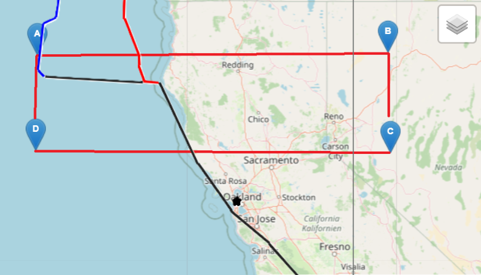

*04-D "WP04-D" added
9 S 601253 4308838
38.92262°N -127.83197°E

*03-C "WP03-C" added
11 S 387062 4303884
38.87656°N -118.30198°E

*02-B "WP02-B" added
11 T 384871 4534204
40.95087°N -118.36789°E

*01-A "WP01-A" added
9 T 601585 4528038
40.89713°N -127.79400°E

